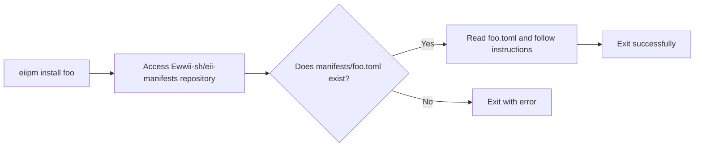

# eii-manifests

Manifest files that **eiipm** will use to install a package.

Here is a simple digram showing how **eiipm** uses **eii-manifests**:



## Adding your package to manifests


### Step 1: Fork the Repository

You must first **[fork the `eii-manifests` repo](https://github.com/Ewwii-sh/eii-manifests/fork)**. This gives you your own copy of the repo which you can edit freely.

---

### Step 2: Create Your Manifest File

1. Navigate to `./manifests/` in your forked repo.
2. Create a TOML file named after your package. Example: `foo.toml` for a package named `foo`.
3. This file is **critical**: `eiipm` reads it directly to know how to install your package.

---

### Step 3: Fill in Metadata

Here’s the **core `[metadata]` structure**:

```toml
[metadata]
name = "your_package_name"
type = "binary" # or "library" / "theme"
src = "https://github.com/yourusername/yourrepo.git"
build = "optional build command, e.g., cargo build --release"
files = ["list of files to install"]
```

#### Field Breakdown

* **name:** Exact name of your package. Should match what you want users to type with `eiipm`.
* **type:** Must be one of `binary`, `library`, or `theme`. This determines install paths:

  * `binary` --> `~/.eiipm/bin/`
  * `library` --> `~/.eiipm/lib/<libname>/`
  * `theme` --> installed in the current working directory.
* **src:** GitHub URL of the repository. Use HTTPS to avoid SSH complications.
* **build:** Optional. Any command needed to compile/build the package before installation.
* **files:** Crucial. Lists **exactly** what should be installed.

---

### Step 4: Advanced `files` Options

You can specify files in multiple ways:

```toml
files = [
  "./src/foo.scss", # simple copy
  "./src/bar.css", # simple copy
  { src = "./path/to/file" }, # preserve relative path
  { src = "./path/to/file2", dest = "./another/path" } # copy to a custom location
]
```

**Notes:**

* `dest` is relative to the target install path (e.g., for a binary, `~/.eiipm/bin/<dest>`).
* Preserving relative paths is useful for libraries with nested directories.

---

### Step 5: Examples by Type

**Binary Example:**

```toml
[metadata]
name = "foo"
type = "binary"
src = "https://github.com/repo/foo.git"
build = "cargo build --release"
files = ["target/release/foo"]
```

**Library Example:**

```toml
[metadata]
name = "bar"
type = "library"
src = "https://github.com/repo/bar.git"
files = ["./src/foo.rhai", "./src/foo2.rhai", "./src/baz.rhai"]
```

**Theme Example:**

```toml
[metadata]
name = "baz"
type = "theme"
src = "https://github.com/repo/baz.git"
files = ["./src/foo.scss", "./src/bar.css", "./src/ewwii.scss"]
```

---

### Step 6: Submit Your Contribution

After adding and committing your manifest to your fork:

1. Push the fork to GitHub.
2. Open a pull request (PR) to the main `eii-manifests` repo.
3. Include any notes about special build instructions or unusual file structures.
