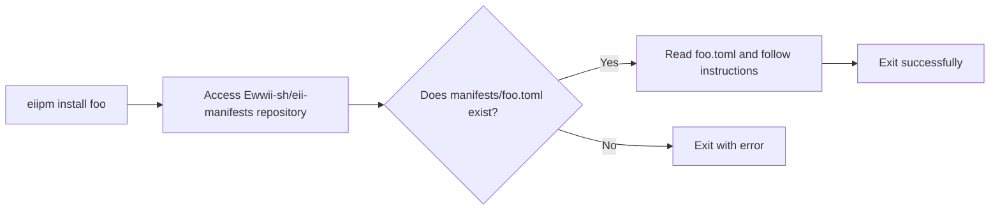

# eii-manifests

Manifest files that **eiipm** will use to install a package.

Here is a simple digram showing how **eiipm** uses **eii-manifests**:



## Adding your package to manifests

Made an awesome binary, library or themes for ewwii and want to publish it to the official manifests? That's great to hear! Your contributions are invaluable for the community and registering it to `eii-manifests` will let anyone download your package easily using eiipm. 

To add a package to the manifests, you would need first need to **[fork](https://github.com/Ewwii-sh/eii-manifests/fork)** this repository. 

Now that you have forked this repo, go to your forked repo and create a file in `./manifests/` with the name of your project and should end in the `.toml` file extension. For example, if you want to register a package named "foo" to the manifests, create a file named `foo.toml` in `./manifests/`. 

And now comes the most important part. Adding instructions in the file you just created. It is extremely important to not mess up as this is the file which **eiipm** will read to install your package.

Here is an example manifest to get you familiar with the structure:

```toml
[metadata]
name = "ewwii"
type = "binary"
src = "https://github.com/Ewwii-sh/ewwii.git"
build = "cargo build --release"
files = ["target/release/ewwii"]
```

This is the manifest of the official `ewwii` binary. Let's get into depth on what each metadata in this toml file should be.

- **[metadata]:** This is the table which **should** contain all metadata.
- **name:** This should be the name of your binary.
- **type:** This should be your package type (supported types: binary, library, theme). This metadata is very crutial as this is the one which eiipm uses to decide where it should install this package to. A binary will be installed to `~/.eiipm/bin/`, a library will be installed to `~/.eiipm/lib/<libname>/` and a theme will be installed to the current directory.
- **src:** This should contain the url to your github repository. You can get this information by clicking the **code** button and then copying the HTTP url in your GitHub repo.
- **build:** This is an optional metadata which **eiipm** will run to build your project before installing it.
- **files:** This should contain all the files which your should be installed. If your type metadata is "binary", then all the files will be copied to `~/.eiipm/bin/`. If your type metadata is "library", then all the files will be copied to `~/.eiipm/lib/<libname>/`. And finally, if your type metadata is "theme", then all the files will be copied to the current directory.

**Here is an example for each type:**

- **type: binary**

```toml
[metadata]
name = "foo"
type = "binary"
src = "https://github.com/repo/foo.git"
build = "cargo build --release"
files = ["target/release/foo"]
```

- **type: library**

```toml
[metadata]
name = "bar"
type = "library"
src = "https://github.com/repo/bar.git"
files = ["./src/foo.rhai", "./src/foo2.rhai", "./src/baz.rhai"]
```

- **type: theme**

```toml
[metadata]
name = "baz"
type = "theme"
src = "https://github.com/repo/baz.git"
files = ["./src/foo.scss", "./src/bar.css", "./src/ewwii.scss"]
```
